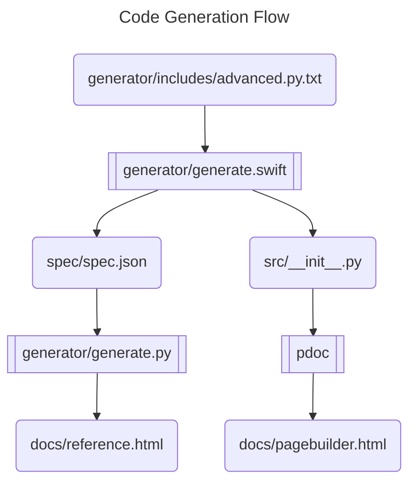

# Contributing to PageBuilder

## Architecture
`generate.swift`, `generate.py`, and `pdoc` are executed. Everything else is either an input or an output

Due to the architecture above, pull requests should be submitted only to files in the `/generator` subdirectory since everything else is generated from those files

## Why Code Generation?
We want to minimize the need to have to search through documentation. Our goal is to be able to rely on autocomplete. To that end, we want to be able to attach `.add_*` methods to all appropriate components so that the list of available components in the current context is available. In order to minimize copy/paste, it's easiest to just generate the library code from a central definition.

## Why Swift?
Very strongly typed languages with exhaustive enum checking makes code generation a lot more robust. Of the languages that would suit this criteria, Swift is probably the most readable for Python developers.