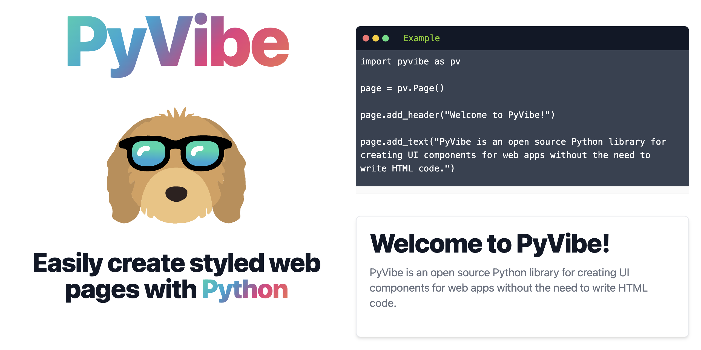
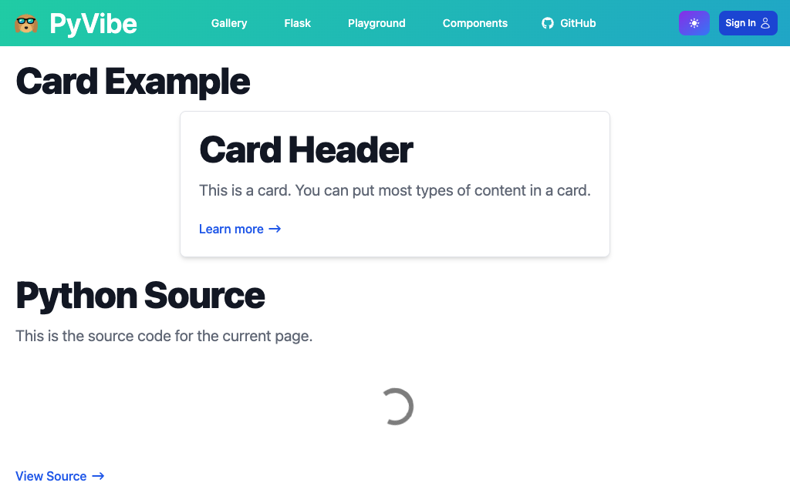
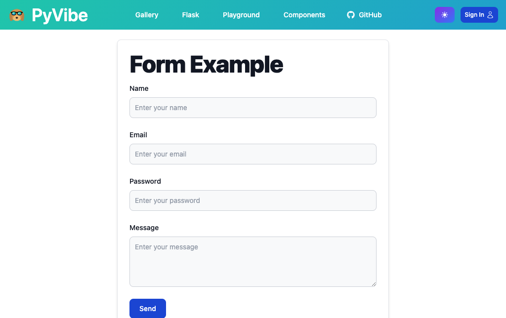
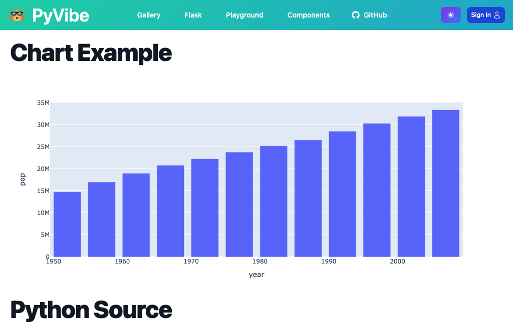
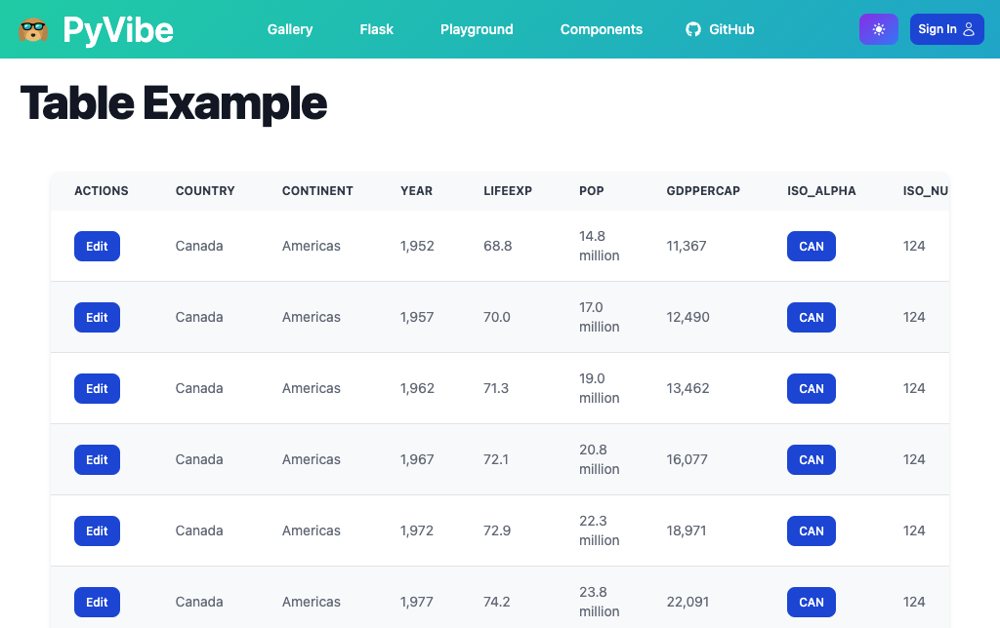
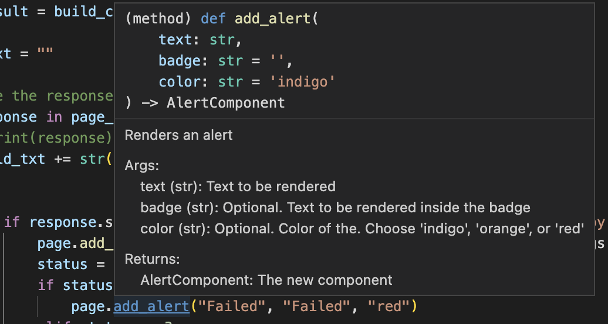

# PyVibe

https://www.pyvibe.com/ | [Examples](https://www.pyvibe.com/gallery.html) | [Use With Flask](https://www.pyvibe.com/flask.html) | [Live Playground](https://www.pyvibe.com/playground.html) | [Component Reference](https://www.pyvibe.com/component_reference.html) |



## Easily create styled web pages with Python


```python
import pyvibe as pv

page = pv.Page()

page.add_header("Welcome to PyVibe!")

page.add_text("PyVibe is an open source Python library for creating UI components for web apps without the need to write HTML code.")
```

[See all components](https://www.pyvibe.com/component_reference.html) 

[Interactive playground](https://www.pyvibe.com/playground.html) 

## What is PyVibe?

PyVibe is a Python library for creating web pages. It is designed to be a quick way for Python developers to build front-ends.

PyVibe uses a component-based approach to building web pages. This means that you can create a page by combining components together.

## How do I use PyVibe?

PyVibe is a Python library that simplifies UI development for web apps by providing semantic Python components that compile into HTML and can be used with any web framework.

Fundamentally, PyVibe returns an HTML string that can be used with:

- [Static Pages](https://github.com/pycob/pyvibe/blob/main/generator/docs/about.py): Using `.to_html()`
- [Flask](https://www.pyvibe.com/flask.html): Inside a Flask function
- [Pyodide](https://github.com/pycob/pyvibe/blob/main/generator/docs/playground.py#L124-L151): For dynamic client-side rendered pages (experimental)

## What can you build with PyVibe?
<a href="https://www.pyvibe.com/gallery/card.html"></a>
<a href="https://www.pyvibe.com/gallery/form.html"></a>
<a href="https://www.pyvibe.com/gallery/chart.html"></a>
<a href="https://www.pyvibe.com/gallery/table.html"></a>

[More Examples](https://www.pyvibe.com/gallery.html)

## Designed for Autocomplete
PyVibe is designed to be used with autocomplete. This means that you can type `page.add_` and autocomplete will show you all the components that you can add to your page along with documentation about the component.



## Themes
PyVibe is meant to be a generic framework. While the default theme uses [Flowbite](https://flowbite.com/), which are components that use [TailwindCSS](https://tailwindcss.com/), we envision including many themes and CSS frameworks in the future.

## How does PyVibe compare to Streamlit, Plotly Dash, Pynecone, Anvil, NiceGUI, etc?
PyVibe is not a web server -- it produces styled HTML that can be used with any web server.

## Getting Started
- To get started with PyVibe, simply install the library using pip:

```bash
pip install pyvibe
```
Once installed, you can begin creating UI components by creating a new Page object and adding components to it using the `.add_*` methods. You can then return the page as HTML by calling `page.to_html()`.

For example, to create a new page with a header and a paragraph of text, you could use the following code:

```python
import pyvibe as pv

page = pv.Page()
page.add_header("Welcome to PyVibe!")
page.add_text("PyVibe is a Python library for creating UI components for web apps without the need to write HTML code.")
print(page.to_html())
```

This will output the following HTML (simplified for readability but it also includes the rest of the HTML document including a navbar, footer, head tag, etc):

```html
<div id="page-container" class="container px-5 my-5 mx-auto">
    <p class="mb-4 font-extrabold leading-none tracking-tight text-gray-900 dark:text-white  text-xl sm:text-5xl ">Welcome to PyVibe!</p>
<p class="mb-6 text-lg font-normal text-gray-500 lg:text-xl dark:text-gray-400">PyVibe is a Python library for creating UI components for web apps without the need to write HTML code.</p> 
</div>
```

## Contributions
PyVibe is an open-source library, and [contributions](CONTRIBUTING.md) are welcome! If you have an idea for a new feature or theme, or if you find a bug and want to submit a fix, feel free to open a pull request.

Thanks for considering PyVibe!